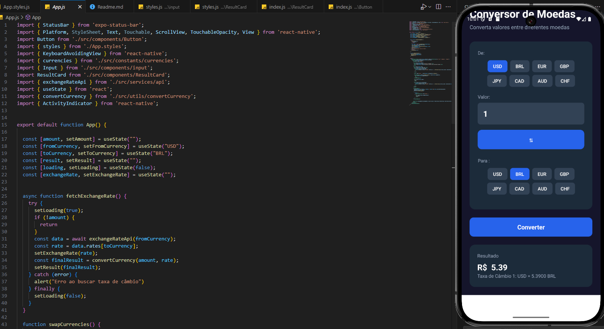

# Conversor de Moedas

Conversor de Moedas é um aplicativo mobile desenvolvido em React Native com Expo, que permite converter valores entre diferentes moedas utilizando taxas de câmbio em tempo real.

## Preview



## Funcionalidades

- Seleção de moeda de origem e destino
- Digitação do valor a ser convertido
- Conversão instantânea com taxa de câmbio atualizada
- Interface intuitiva e responsiva
- Suporte a múltiplas moedas: USD, BRL, EUR, GBP, JPY, CAD, AUD, CHF

## Estrutura do Projeto

```
├── App.js
├── App.styles.js
├── index.js
├── package.json
├── app.json
├── .expo/
├── .vscode/
├── assets/
│   ├── adaptive-icon.png
│   ├── favicon.png
│   ├── icon.png
│   └── splash-icon.png
└── src/
    ├── components/
    │   ├── Button/
    │   │   ├── index.js
    │   │   └── styles.js
    │   ├── input/
    │   │   ├── index.js
    │   │   └── styles.js
    │   └── ResultCard/
    │       ├── index.js
    │       └── styles.js
    ├── constants/
    │   └── currencies.js
    ├── services/
    │   └── api.js
    ├── styles/
    │   └── colors.js
    └── utils/
        └── convertCurrency.js
```

## Instalação

1. **Clone o repositório:**
   ```sh
   git clone https://github.com/seu-usuario/conversor-app.git
   cd conversor-app
   ```

2. **Instale as dependências:**
   ```sh
   npm install
   ```

3. **Inicie o projeto:**
   ```sh
   npm start
   ```
   Ou utilize:
   ```sh
   expo start
   ```

4. **Execute no dispositivo ou emulador:**
   - Android: pressione `a`
   - iOS: pressione `i`
   - Web: pressione `w`

## Como Usar

1. Selecione a moeda de origem e destino.
2. Digite o valor que deseja converter.
3. Clique em **Converter** para ver o resultado.
4. Use o botão de troca para inverter as moedas.

## Tecnologias Utilizadas

- [React Native](https://reactnative.dev/)
- [Expo](https://expo.dev/)
- [JavaScript](https://developer.mozilla.org/pt-BR/docs/Web/JavaScript)
- [ExchangeRate API](https://www.exchangerate-api.com/)

## Organização dos Componentes

- **Button:** Botão customizado para seleção de moedas.
- **Input:** Campo para digitação do valor.
- **ResultCard:** Exibe o resultado da conversão.

## Personalização

- As cores e estilos podem ser alterados em [`src/styles/colors.js`](src/styles/colors.js) e [`App.styles.js`](App.styles.js).
- As moedas disponíveis estão em [`src/constants/currencies.js`](src/constants/currencies.js).

